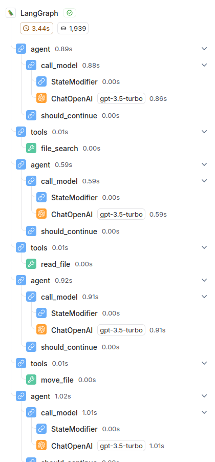

# CMDChain - Your LLM Command Line Agent

Welcome to **CMDChain**! This little project combines the magic of Large Language Models (LLMs) with the humble command line, giving you a server-based agent that can execute command line commands right from an API request. If you've ever wanted to tell a computer to do your bidding in plain language, you've found the right place.

## What Does CMDChain Do?

CMDChain lets you:

- **Talk to Your Server**: Send natural language instructions like, "Find all `.txt` files in a folder and rename the ones with the word 'log' to `.log` files."
- **Simple Command Line Control**: Navigate the file system, create, read, or modify files—all by chatting with your agent.
- **Interact through API**: Use FastAPI/Flask to send JSON requests and get JSON responses. Easy peasy.

## Tech Stack

Here's what keeps CMDChain running smoothly:

- **Python**: The core language for this project.
- **LangChain/LangGraph**: For building the LLM-based agent.
- **FastAPI/Flask**: To create the server that provides the API.
- **OpenAI API**: For powering the agent itself.
- **Poetry**: To keep those pesky dependencies in check.

## Features

- Asynchronous request handling. Because who has time to wait?
- Handles JSON requests and responses for easy integration.
- Makes use of command line tools to fulfill complex instructions.
- Passes all **mypy** and **pylint** checks, and formatted with **black** (you know, because we're professionals).

## Quickstart Guide

### Prerequisites

- **Python 3.12+**
- **Poetry** for dependency management (recommended)
- A working internet connection (to connect to OpenAI and LangSmith APIs)

### Installation

1. Clone this repository:
   ```bash
   git clone https://github.com/mvishiu11/CMDChain.git
   cd CMDChain
   ```

2. Install dependencies using Poetry:
   ```bash
   poetry install
   ```

3. Set up your `.env` file:
   ```
   APP_OPENAI__API_KEY="your_openai_api_key"
   APP_OPENAI__MODEL="gpt-3.5-turbo"

   // Optional: For LangSmith tracing
   LANGCHAIN_TRACING_V2=true
   LANGCHAIN_ENDPOINT="https://api.smith.langchain.com"
   LANGCHAIN_API_KEY="your_langsmith_api_key"
   LANGCHAIN_PROJECT="project-name"
   ```

   - Replace `your_openai_api_key` with your actual OpenAI API key.
   - Replace `your_langsmith_api_key` and `project-name` with your LangSmith project details to enable tracing.

4. Start the server:
   ```bash
   poetry run server
   ```

5. You're ready to send some commands! 🎉

### Example Request

Send a POST request to `http://0.0.0.0:8000/agent` with the following JSON payload:

```json
{
  "msg": "Find all files in directory 'my_dir' with .txt extension. For those containing the word 'log', change their extension to .log."
}
```

Example with curl:

```bash
curl -X POST "http://0.0.0.0:8000/agent" -H "Content-Type: application/json" -d '{"msg": "Change extension of all files in 'test' dir with .txt extension to .log extension."}'
```

The agent will use command line tools to do its best to fulfill your request.

Example response:

```json
{"response":"some.txt\nsomev2.txt\n\n\n\nFile moved successfully from test/some.txt to test/some.log.\n\nFile moved successfully from test/somev2.txt to test/somev2.log.\n\nsome.log\nother.pdf\nsomev2.log\nAll .txt files with the word \"log\" in their content have been changed to have the .log extension in the test directory."}
```

```
some.txt
somev2.txt

File moved successfully from test/some.txt to test/some.log.
File moved successfully from test/somev2.txt to test/somev2.log.

some.log
other.pdf
somev2.log

All .txt files with the word "log" in their content have been changed to have the .log extension in the test directory.
```

Which translates to:

- The agent found two files in the `test` directory with the `.txt` extension.
- It successfully changed their extensions to `.log`.
- It then listed all files in the directory, showing the changes made.

If you enabled LangSmith tracing, you can view the trace in the LangSmith dashboard:



### API Overview

- **Endpoint**: `/agent`
- **Method**: POST
- **Request Body**: JSON containing a `msg` field (string)
- **Response**: JSON containing the result or error message

Request format:

```json
{
  "msg": "Your natural language command here.",   // Required: Natural language command
  "root_dir": "optional_root_directory",          // Optional: Root directory for the command execution (for the file system tool)
  "reset_memory": "true/false"                    // Optional: Reset agent memory before executing the command
}
```

## Contribution Guidelines

Contributions are welcome! Please ensure your code:

- Passes **mypy** and **pylint** checks.
- Is formatted using **black**.
- Includes appropriate docstrings and comments (Google style).

Feel free to open issues or submit pull requests!

## License

This project is licensed under the MIT License. See `LICENSE` for more details.

## Final Thoughts

CMDChain is a fun way to bring natural language control to the command line.

If you have any questions or suggestions, please reach out. We'd love to hear your thoughts!

Happy coding! 🚀
